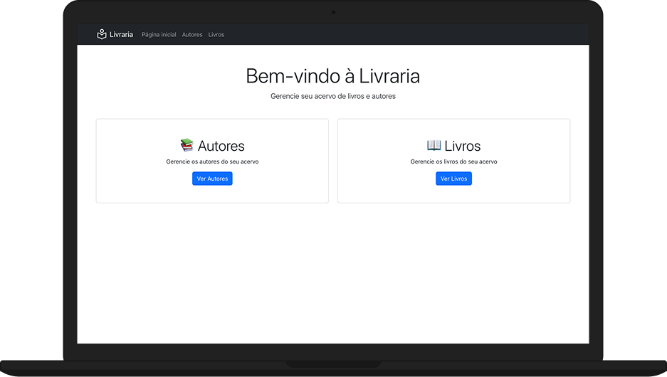
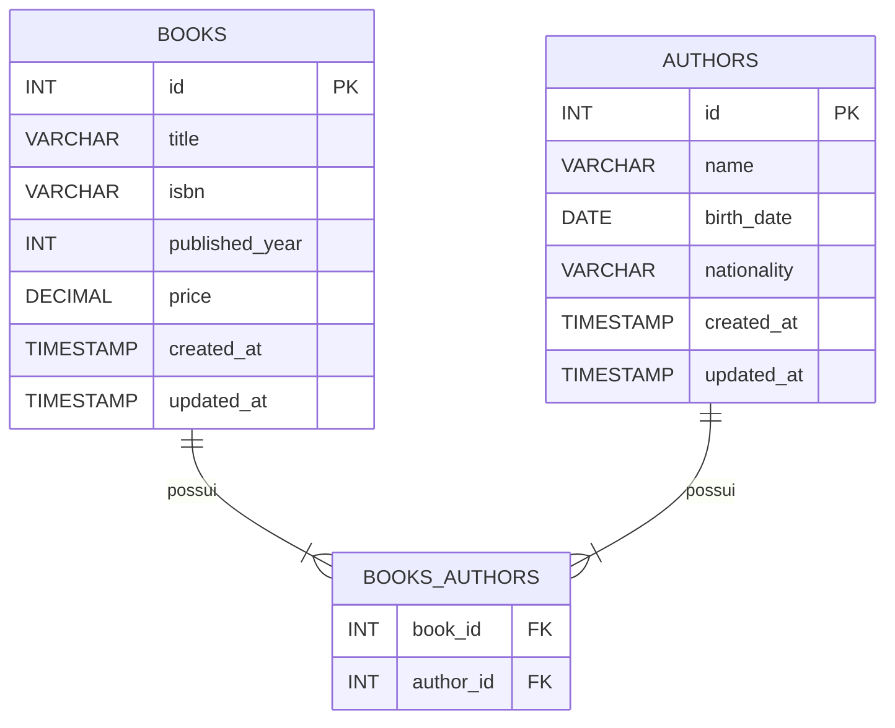

# Tech Challenge



Este Tech Challenge teve como objetivo desenvolver um sistema para gerenciamento de uma livraria. O foco do projeto é no front-end.

## Sumário

- [Tech Challenge](#tech-challenge)
  - [Sumário](#sumário)
  - [Tecnologias utilizadas](#tecnologias-utilizadas)
    - [Estrutura do repositório](#estrutura-do-repositório)
  - [Modelos de dados](#modelos-de-dados)
  - [Instalação e Configuração](#instalação-e-configuração)
    - [Pré-requisitos](#pré-requisitos)
    - [Como instalar](#como-instalar)

## Tecnologias utilizadas

Para desenvolver esse sistema utilizamos as seguintes tecnologias:

- HTML
- CSS
- JavaScript
- NPM
- Bootstrap
- React
- Vite

### Estrutura do repositório

A organização do repositório possui como principais pastas:

```text
.
├── public // Arquivos estáticos
└── src
    ├── components # Componentes reutilizáveis pelas páginas principais
    └── pages # Páginas principais
```

## Modelos de dados



## Instalação e Configuração

### Pré-requisitos

- [NodeJs](https://nodejs.org/en/download/)
- [NPM](https://docs.npmjs.com/downloading-and-installing-node-js-and-npm)

### Como instalar

1. Instalar as dependências:

```bash
    npm install
```

2. Iniciar a aplicação:

```bash
    npm run dev
```
